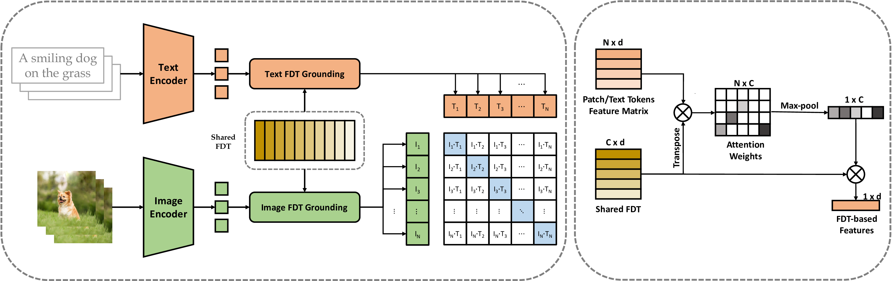

# Revisiting Multimodal Representation in Contrastive Learning: From Patch and Token Embeddings to Finite Discrete Tokens

This repository is a re-implementation of the paper [Revisiting Multimodal Representation in Contrastive Learning: From Patch and Token Embeddings to Finite Discrete Tokens](https://arxiv.org/abs/2303.14865). It includes PyTorch code for pretraining and zero-shot evaluation.

<p align="center"></p>


```
@inproceedings{chen2023revisiting,
  title={Revisiting multimodal representation in contrastive learning: from patch and token embeddings to finite discrete tokens},
  author={Chen, Yuxiao and Yuan, Jianbo and Tian, Yu and Geng, Shijie and Li, Xinyu and Zhou, Ding and Metaxas, Dimitris N and Yang, Hongxia},
  booktitle={Proceedings of the IEEE/CVF Conference on Computer Vision and Pattern Recognition},
  pages={15095--15104},
  year={2023}
}
```

## Installation
Please run the following commands in your shell:
```
conda create -n fdt python=3.8
conda activate fdt
pip install -r requirements.txt
```


## Dataset Preparation
### Pre-training

This paper uses four publicly available datasets for pre-training, including [YFCC-15M V2](https://github.com/Sense-GVT/DeCLIP/blob/main/docs/dataset_prepare.md), [Conceptual Captions (CC3M)](https://ai.google.com/research/ConceptualCaptions/), [Conceptual 12M (CC12M)](https://github.com/google-research-datasets/conceptual-12m), and [LAION115M](https://github.com/salesforce/BLIP).

In this repository, we pre-train the model using the CC3M dataset. The data preparation process is outlined as follows:

1. Download the dataset using the [script](https://github.com/rom1504/img2dataset/blob/main/dataset_examples/cc3m.md) provided by [img2dataset](https://github.com/rom1504/img2dataset). The downloaded dataset is saved as the [webdataset](https://github.com/webdataset/webdataset) format. There are a series of .tar files. Each file is a ``shard'', and it has two files for each training sample, one for the image and one for the corresponding text.
2. We further process the shards using [tarproc](https://github.com/tmbdev-archive/tarproc) to make that each shard contains 1,000 samples:
```
git clone https://github.com/tmbdev-archive/tarproc #install tarproc
python data_process/wds/process_download_data.py \
    --src_fold ${path/to/downloaded/data} \
    --res_fold ${path/to/save/results} \
    --tarproc_fold ${path/to/tarpoc/folder}
```

### Evaluation

#### ImageNet
1. Create a folder named `ImageNet-1K/` under `$DATA`. 
2. Download the validation set from the [official website](https://image-net.org/index.php) and extract it.
3. Download the label file from DeClip - [val_official.json](https://drive.google.com/file/d/1fgfjEzUwxEgLeOFon18kVvsOtp7KV7vh/view?usp=sharing)
4. Download the list of image paths - [val_datalist.pkl](https://drive.google.com/file/d/13EPcvJy4JaSmBqDdH88kvgb08Zt9MOKR/view?usp=sharing)
```
ImageNet-1K/
|–– val/ # contains 1,000 folders like n04357314, n03976657, etc.
|-- val_official.json 
|-- val_datalist.pkl
```


#### MSCOCO
1. Create a folder named `coco/` under `$DATA`.
2. Download the validation set from [official website](http://images.cocodataset.org/zips/val2014.zip) and extract it under '$DATA/coco/'.
3. Download the list of image names and their captions- [testall.pkl](https://drive.google.com/file/d/1ynCrHi2kB_-332nM9fmodxDpx8iLe8F5/view?usp=sharing), and place it under '$DATA/coco/', resulting in the following directory structure:
```
coco/
|–– val2014/ #
|-- testall.pkl
```

## Pre-training
1. Modify the below parameters in `example/clip_fdt/config_cc3m.yaml`:
```
data.train.data_path ---> the path of the preprocessed CC3M dataset.
data.train.num_samples --->  the total number of samples.
data.train.num_shards --> the number of shards.
saver.save_freq --> the iteration times for saving checkpoints.
lr_scheduler.max_iter --> the total number of iterations for pre-training. It is the product of data.train.data.epoch and the number of iterations for an epoch.
```

2. Run the following command to start pre-training:
```
bash run.sh example/clip_fdt/train_solver.py \
--config example/clip_fdt/config_cc3m.yaml \
--output_path ${path/to/save/log_and_ckpt} \
--batch_size 128 # batch size for each GPU
```

## Testing
1. Change the below parameters in `example/clip_fdt/test.sh` :
```
MODEL_FOLD: the path to the folder where the pre-trained models and config files are saved.
DATA_FOLD: the path to the folder where the downstream datasets are saved.
```
2. Run the following command:
```
bash example/clip_fdt/test.sh
```

## Our pre-trained models
|  Method  | Dataset |  Model  | Total batch size | Epochs | 0-shot IN (ACC) | 0-shot coco  (rsum) |     Weights      |
|:--------:|:-------:|:-------:|:----------------:|:------:|:---------------:|:-------------------:|:----------------:|
|   CLIP   |   CC3M  | ViT-B32 |       1024       |   32   |       15.4      |        145.1        | [GoogleDriver](https://drive.google.com/file/d/1sbAK1r03rDS-4A2Fl5JyWyXTy_kRD784/view?usp=sharing) |
| CLIP+FDT |   CC3M  | ViT-B32 |       1024       |   32   |       18.4      |        189.5        | [GoogleDriver](https://drive.google.com/file/d/12lD85bouO0fA1TK4wgqBi052X84BU_hB/view?usp=sharing) |

## Acknowledgement
Part of our code is borrowed from the following repositories/sources. We express our gratitude to the authors for releasing their codes.
* https://github.com/Sense-GVT/DeCLIP/tree/main
* https://github.com/openai/CLIP
* https://github.com/mlfoundations/open_clip
* https://github.com/KaiyangZhou/CoOp

